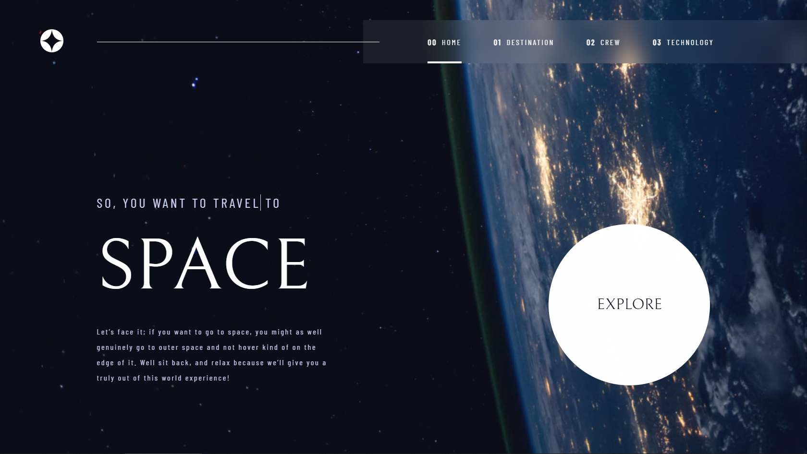

# Frontend Mentor - Space tourism website solution

This is a solution to the [Space tourism website challenge on Frontend Mentor](https://www.frontendmentor.io/challenges/space-tourism-multipage-website-gRWj1URZ3). Frontend Mentor challenges help you improve your coding skills by building realistic projects. 

## Table of contents

- [Overview](#overview)
  - [The challenge](#the-challenge)
  - [Screenshot](#screenshot)
  - [Links](#links)
- [My process](#my-process)
  - [Built with](#built-with)
  - [What I learned](#what-i-learned)
- [Author](#author)

## Overview

### The challenge

Users should be able to:

- View the optimal layout for each of the website's pages depending on their device's screen size
- See hover states for all interactive elements on the page
- View each page and be able to toggle between the tabs to see new information

### Screenshot

### Links

- Solution URL: [solution URL](https://github.com/AhmedMahim/space-tourisme-website-animated-frontendmentor)
- Live Site URL: [live site URL](https://space-tourisme-website-animated-frontendmentor.netlify.app/destination-moon.html)

## My process

### Built with

- Semantic HTML5 markup
- CSS custom properties
- Flexbox
- Mobile-first workflow
- Keyframes
- Vanilla Javascript

## Author

- Website - [My Github](https://github.com/AhmedMahim)
- Frontend Mentor - [@AhmedMahim](https://www.frontendmentor.io/profile/AhmedMahim)
- Twitter - [@yourusername](https://www.twitter.com/Ahmedmahim26)
- LinkedIn - [@ahmed-mahim-741261228](https://www.linkedin.com/in/ahmed-mahim-741261228/)
- Youtube - [@Ahmed Mahim](https://www.youtube.com/channel/UCJ_6OzqX1KnXCCz8CwH6pqg)
